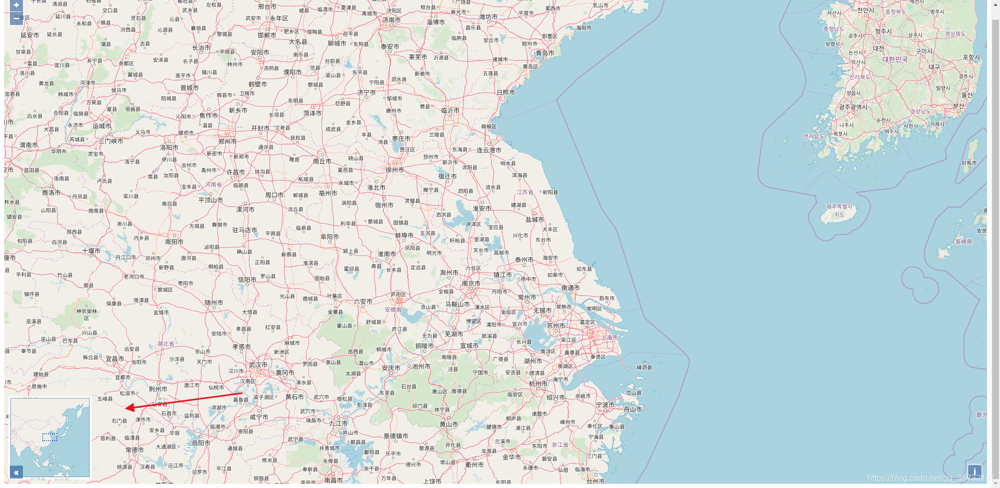

> https://blog.csdn.net/qq_35732147/article/details/90755781?spm=1001.2014.3001.5502
# 一、地图控件简介

## Openlayers 封装了很多控件用于对地图进行操作、显示地图信息等
具体来讲，控件是一个地图上可见的小部件，其中 DOM 元素位于屏幕上的固定位置。它们可以包含用户输入(以按钮的形式)，也可以只提供信息。控件的位置是使用 css 来确定，当然也可以使用 css 来调整。默认情况下，控件被放置在地图控件层，也就是 css 类名为 ol-overlayContainer-stopEvent 的元素中，但是也可以调整，使控件基于外部 DOM 元素来实现。

#### 从 OpenLayers 的 API 来看，具体有如下控件类：

#### 具体来说，这些控件是干嘛的呢？这里简单介绍一下
* 归属控件（Attribution） —— 用于展示地图资源的版权或者归属，它会默认加入到地图中。
* 全屏控件（FullScreen） —— 控制地图全屏展示
* 坐标拾取控件（MousePosition） —— 用于在地图上拾取坐标
* 鹰眼控件（OverviewMap） —— 生成地图的一个概览图
* 旋转控件（Rotate） —— 用于鼠标拖拽旋转地图，它会默认加入到地图中。
* 比例尺控件（ScaleLine） —— 用于生成地图比例尺
* 滑块缩放控件（ZoomSlider） —— 以滑块的形式缩放地图
* 缩放至特定位置控件（ZoomToExtent） —— 用于将地图视图缩放至特定位置
* 普通缩放控件（Zoom） —— 普通缩放控件，它会默认加入到地图中。

# 二、普通缩放控件
将开发者工具的选项卡切换到console，然后输入map.getControls().getArray()，会打印如下内容：

map.getControls().getArray()会返回一个数组，里面包含了地图中默认的控件实例，而这个数组的第一个元素就是普通缩放控件的实例了。
查看ol.control.Zoom类的API文档，可以发现OpenLayers设计了许多属性以方便开发人员对普通缩放控件进行调整。

可以通过为target属性赋值为自定义的DOM元素来为普通缩放控件绑定指定的DOM元素。

# 三、滑块缩放控件
普通缩放控件（ol.control.Zoom）是会被默认加入到地图中的，而滑块缩放控件（ol.control.ZoomSlider）不会被默认加入到地图中，因此我们来编写代码将其加入，修改zoom.html。

OpenLayers实现了一个对原生JavaScript的Array类进行扩展的类ol.Collection，Map对象会保存一个ol.Collection实例用于存放控件。

上面的新增代码中，ol.control.defaults()方法就用于返回保存默认控件的ol.Collection实例，然后使用ol.Collection类的extend()方法往里增加了滑块缩放控件。
```
new ol.control.ZoomSlider()
```

# 四、缩放至特定位置控件
```
new ol.control.ZoomToExtent({           // 缩放至特定位置控件      
    extent: [
        12667718, 2562800,
        12718359, 2597725
    ]
})
```
这里new了一个ol.control.ZoomToExtent类的实例，从而创建了一个缩放至特定位置控件。其中的extent属性用于指定缩放的目标位置，它是一个数组，前两个元素表示位置矩形的左下角坐标，后两个元素表示位置矩形的右上角坐标：

最后通过ol.Collectionl类的extend()方法将该控件增加到地图中.

# 五、修改控件样式
见代码

# 六、归属控件
归属控件(ol.control.Attribution)用于展示地图资源的版权或归属，它会默认加入到地图中。


# 七、全屏控件
```
new ol.control.FullScreen()
```


# 八、坐标拾取控件
很多时候我们想要实时获取鼠标光标指示处对应的坐标，就像高德地图的坐标拾取：https://lbs.amap.com/console/show/picker

OpenLayers提供的ol.control.MousePosition类也能够实现坐标拾取功能。
```
new ol.control.MousePosition()
```


# 九、鹰眼控件
```
controls: ol.control.defaults().extend([
    new ol.control.OverviewMap({ // 实例化一个OverviewMap类的对象，并加入到地图
        collapsed: false // 鹰眼窗口是否默认关闭
    })
])
```


# 十、地图旋转控件
地图旋转控件(ol.control.Rotate)默认被自动加入到地图中，所以每一个使用Openlayers创建的地图中都包含了旋转控件。
使用浏览器打开simple_map.html，同时按住键盘的Shift键+Alt键，然后用鼠标拖拽地图，可以使地图旋转：

此时地图右上角会出现一个复位键，点击它可以让地图恢复原始角度。

# 十一、比例尺控件
Openlayers使用ol.control.ScaleLine类实现了地图比例尺功能。
```
 controls: ol.control.defaults().extend([
    new ol.control.ScaleLine({
        units: 'metric', // 比例尺默认单位
    }),
])
```

可以发现，这里比例尺控件使用的单位是km，如果想使用其他单位，可以修改ScaleLine类中的units属性。
units属性接受"degrees"、"imperial"、"us"、"nautical"或"metric"（默认为”metric")。