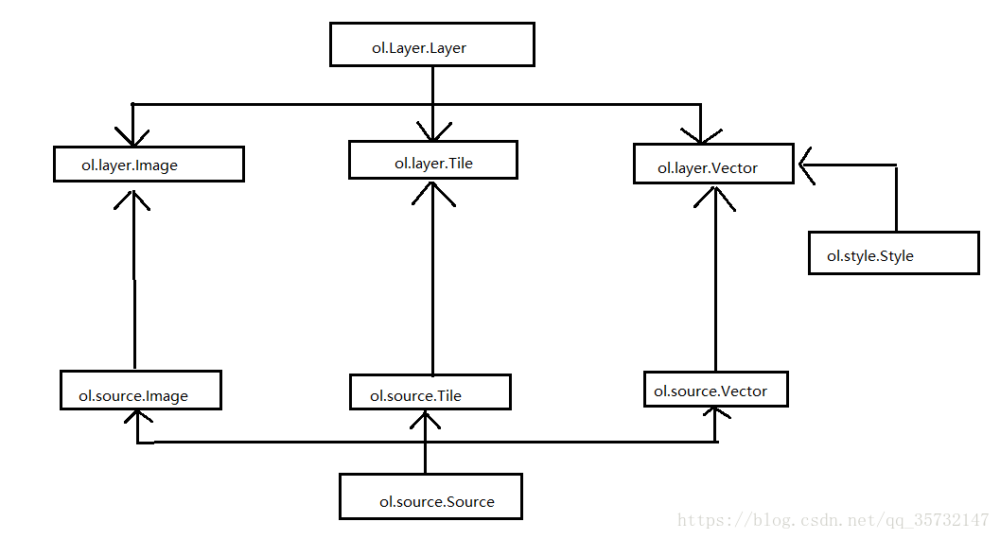
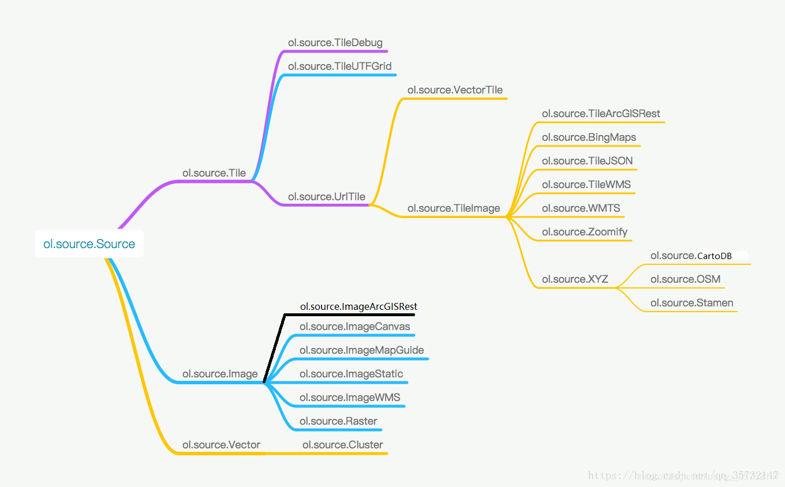
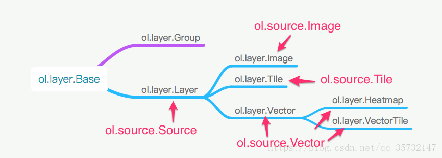
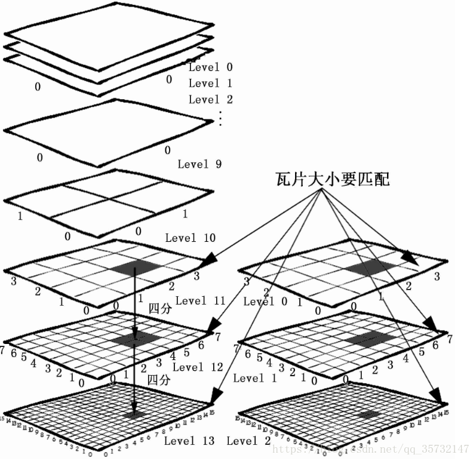
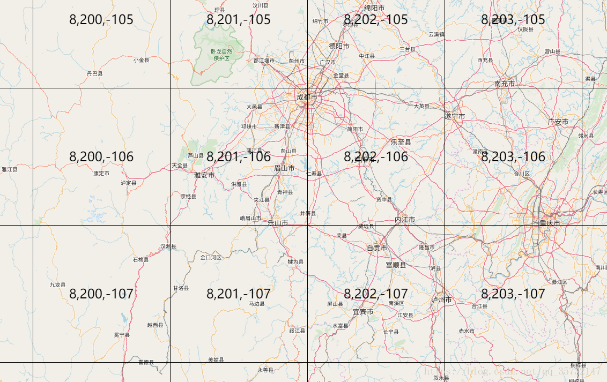

> https://blog.csdn.net/qq_35732147/article/details/94441579?spm=1001.2014.3001.5502

# 一、图层切换控件
> 练习: layerSwitch.html

代码整体逻辑很简单，其中使用了事件委托机制来绑定事件，事件委托可以减少事件绑定导致的内存消耗，所以平时开发时推荐多使用事件委托。

另外，map.getLayers()返回一个ol.Collection类的对象，该对象中包含了地图中的三个图层对象(ol.layer.Tile)，可以为item()方法传入对应索引来取出对应图层对象。

最后，ol.layer.Tile类的setVisible()方法可以设置图层的显示与隐藏。

# 二、多源数据加载之数据组织
数据是GIS的血液，可以说GIS应用系统的几乎所有活动与行为都围绕数据展开。那么在GIS对数据加载、存储、分析与操作这几个过程中，我们首先讨论在由OpenLayers构建的WebGIS系统中，数据如何合理加载。    

随着WebGIS应用的不断发展，目前出现了大量网络地图服务资源，包括国外互联网公司的Google地图、Bing 地图、Yahoo 地图，国外的开源地图OpenStreetMap，也包括国内互联网公司的百度地图、高德地图、腾讯地图。还有ESRI、超图、中地数码等大型GIS厂商提供的自定格式的GIS数据，以及其他企事业单位或研究机构提供的各种格式的GIS数据等。如何将这些多源异构数据加载到Web客户端中进行显示，实现数据无缝融合，这是WebGIS中需要首先解决的关键问题。

Openlayers的地图数据通过<b>图层(Layer)</b>进行组织渲染，然后通过<b>数据源(Source)</b>设置具体的地图数据来源。

Layer可看作渲染地图的容器层，具体的数据需要通过Source设置。

地图数据根据数据源(Source)可分为<b>Image、Title、Vector</b>三大类型的数据源类，对应设置到地图图层(Layer)的<b>Image、Title、Vector</b>三大类的图层中。其中，矢量图层Vector通过样式(<b>Style</b>)来设置矢量要素渲染的方式和外观。
Source和Layer是一对一的关系，有一个Source，必然需要一个Layer，然后把Layer添加到Map上，就可以显示出来了。


在数据源中：
* Tile类为瓦片抽象基类，其子类作为各类瓦片数据的数据源。
* Vector类为矢量数据源基类，为矢量图层提供具体的数据来源，包括直接组织或读取的矢量数据（Features）、远程数据源的矢量数据（即通过url设置数据源路径）等。若是url设置的矢量数据源，则通过解析器Format（即ol.format.Feature的子类）来解析各类矢量数据，如XML、Text、JSON、GML、KML、GPS、WFS、WKT、GeoJSON等地图数据。
* Image类为单一图像基类，其子类为画布（canvas）元素、服务器图片、单个静态图片、WMS单一图像等的数据源。它与Tile类的区别在于，Image类对应的是一整张大图片，而不像瓦片那样很多张小图片，从而无需切片，也可以加载一些地图，适用于一些小场景地图。

从复杂度来分析，Image类和Vector类都不复杂，其数据格式和来源方式都简单。而Tile类则不一样，由于一些历史问题，多个服务提供商，多种标准等诸多原因，导致要支持世界上大多数的瓦片数据源，就需要针对这些差异（这些差异主要是瓦片坐标系不同、分辨率不同等，后面会详细介绍）提供不同的Tile数据源支持。我们先来看一下OpenLayers现在支持的Source具体有哪些：


上图中的类是按照继承关系，从左向右展开的，左边的为父类，右边的为子类。在使用时，一般来说，都是直接使用叶子节点上的类，基本就可以完成需求。父类需要自己进一步扩展或者处理才能有效使用。

我们先了解最为复杂的ol.source.Tile，其叶子节点类有很多，大致可以分为几类：

* 在线服务的Source，包括ol.source.BingMaps（使用的是微软提供的Bing在线地图数据）、ol.source.Stamen（使用的是Stamen提供的在线地图数据）。没有自己的地图服务器的情况下，可直接使用它们，加载地图底图。
* 支持协议标准的Source，包括ol.source.TileArcGISRest、ol.source.TileWMS、ol.source.WMTS、ol.source.UTFGrid、ol.source.TileJSON。如果要使用它们，首先你得先学习对应的协议，之后必须找到支持这些协议的服务器来提供数据源，这些服务器可以是底图服务提供商提供的，也可以是自己搭建的服务器，关键是得支持这些协议。
* ol.source.XYZ，这个需要单独提一下，因为是可以直接使用的，而且现在很多地图服务（在线的，或者自己搭建的服务器）都支持xyz方式的请求。国内在线的地图服务，高德、天地图等，都可以通过这种方式加载，本地离线瓦片地图也可以，用途广泛，且简单易学。
ol.source.Image虽然有几种不同的子类，但大多比较简单，因为不牵涉到过多的协议和服务提供商。而ol.source.Vector就更加简单了，但有时候其唯一的子类ol.source.Cluster在处理大量的要素时，我们可能需要使用。

在大概了解了整个Source之后，紧接着该介绍它的搭档Layer了，同样的，我们还是先从OpenLayers现有的Layer类图大致了解一下：


为了便于了解和使用，图中标注了每一个Layer对应的Source。通过上图可以看到Layer相对于Source而言，真是太简单了。

其中ol.layer.Group是一个用于将多个图层存储在一起的集合类，以后接触到相关内容再介绍。

# 三、瓦片地图
## 简介
瓦片地图(也叫切片地图)源于一种大地图解决方案，就是在多个比例尺下配置地图，然后提前把每个比例尺下的地图绘制为小块图片（瓦片），保存在服务器上用于缓存的目录中。这样客户端在访问地图时，可以直接获取需要的小块图片拼接成整幅地图，而不是由服务器动态创建（实时创建）出一幅图片再发送到客户端，从而极大提高了访问速度。

瓦片地图起始于谷歌地图。在2005年前后谷歌地图已经开始将矢量图层融合为一张栅格化的大图像，大图像被切分为256像素 x 256像素的图片（瓦片）。这些图片预先生成并存储在磁盘上，以便快速分发（通过AJAX）到客户端。这样做可以同时支持成千上万个并发请求（异步-因为瓦片地图根据请求范围加载），而这对于动态地图绘制而言基本是不可能的。

瓦片地图的缺点是不能改变图层的符号，可以认为它们是一些"死图片"，不能进行更新。因此，WebGIS中通常的做法是将通用的基础底图图层发布为瓦片，在其上叠加另外的包含专题信息的图层，这种图层结构可以被比喻为"图层三明治"。

## 瓦片计算
### 切片方式
如果对整个地球进行切片，需要考虑的是整个地图图片大小，以及切片规则，切片(瓦片)大小。
对于WebGIS而言，在线地图几乎都采用Web墨卡托投影坐标系(EPSG:3857)，地球投影到平面上就是一个正方形。为了方便使用，切片时大多按照正方形的方式来进行切片，比如大小为256*256的瓦片（单位像素），一个1024*1024的地图，就可以切片4张小的256*256的瓦片。

瓦片大小几乎都是256 * 256,有一些则会增加到512 * 512（由于以前的屏幕分辨率通常比较低，所以256 * 256的瓦片在低分辨率的屏幕上显示效果比较好，随着屏幕分辨率的提高，瓦片大小自然就会增加到512 * 512。但目前主流仍是256 * 256大小的瓦片）。
LOD(Levels of Detail:细节层级)会使得不同层级下的全球地图大小不一致，结合瓦片地图技术一起，就出现了金字塔瓦片结构：

在金字塔瓦片结构中，上一层级的一张瓦片，在更大一层级中，会用4张瓦片来表示，依次类推，比如上一篇文章中看到的Google在线瓦片地图的第0级和第1级的瓦片地图就呈现这样的规律。这样做可以维持正方形的投影方式不变，同时按照2的幂次方放大（瓦片的边长），计算效率非常高。

### 瓦片数量计算
通过上面切片的介绍，我们可以对每一层级拥有的瓦片的数量进行简单的计算：

* 层级0的瓦片数是 1 = 2^​0 ​​∗ 2^​0
* 层级1的瓦片数是 4 = 2^1 * 2^1
* 层级2的瓦片数是 16 = 2^2 * 2^2
* 层级3的瓦片数是 64 = 2^3 * 2^3
* 层级z的瓦片数是 2^z * 2^z
### 瓦片坐标系
从以上的金字塔瓦片结构可以看出来，瓦片的组织方式是三维的，因此对一幅地图进行切片时，需要给每一块瓦片进行详细的编号，即需要指定每一块瓦片的行号、列号以及层级数。

这个问题就涉及到了瓦片坐标系，瓦片坐标系是瓦片地图的组织参考框架。它规定每一块瓦片的行号、列号以及层级数，另外，在瓦片坐标系中列号一般从左到右方向递增，而在瓦片坐标系中行号有可能沿着从上到下的方向递增，或者从下到上递增，所以不同的瓦片坐标系的起始点（原点）不同。

不同的在线地图服务商，可能定义不一样的瓦片坐标系，瓦片坐标系不一样，那么对应的同一个位置的瓦片的坐标也会不一样。需要引起重视。

OpenLayers提供了一个用于调试瓦片坐标系的ol.source.TileDebug类。借助这个类，我们可以清晰的看到每一个瓦片的坐标：

首先从上图可以看到地图上多了网格，每一个网格对应的就是一个瓦片。

其次网格中有三个数字，这些数字就表示当前瓦片的坐标：

* 第一个数字是层级z
* 第二个数字是表示经度方向上的x（列号）
* 第三个数字是表示纬度方向上的y（行号）

# 四、最简单的方式加载瓦片地图
OpenLayers封装了一些瓦片地图源类用于加载瓦片地图，这些类包括：

* ol.source.OSM    ——    用于加载OpenStreetMap
* ol.source.Stamen    ——    用于加载Stamen Map
* ol.source.BingMaps    ——    用于加载Bing Map
## 加载OpenStreetMap
> loadOSM.html

## 加载Stamen Map
> loadStamenMap.html

## 加载Bing Map
> loadBingMap.html

# 五、使用XYZ的方式加载瓦片地图
> loadOSM_XYZ.html
```
new ol.layer.Tile({
    source: new ol.source.XYZ({
        // 使用XYZ的方式加载OpenStreetMap
        url: "http://{a-c}.tile.openstreetmap.org/{z}/{x}/{y}.png",
    }),
}),

new ol.layer.Tile({
    source: new ol.source.XYZ({
        // 使用XYZ方式加载高德地图
        url: 'http://webst0{1-4}.is.autonavi.com/appmaptile?lang=zh_cn&size=1&scale=1&style=7&x={x}&y={y}&z={z}'
    }),
}),
```
目前高德的瓦片地址有如下两种：

* http://wprd0{1-4}.is.autonavi.com/appmaptile?x={x}&y={y}&z={z}&lang=zh_cn&size=1&scl=1&style=7和
* http://webst0{1-4}.is.autonavi.com/appmaptile?style=7&x={x}&y={y}&z={z}
前者是高德的新版地址，后者是老版地址。